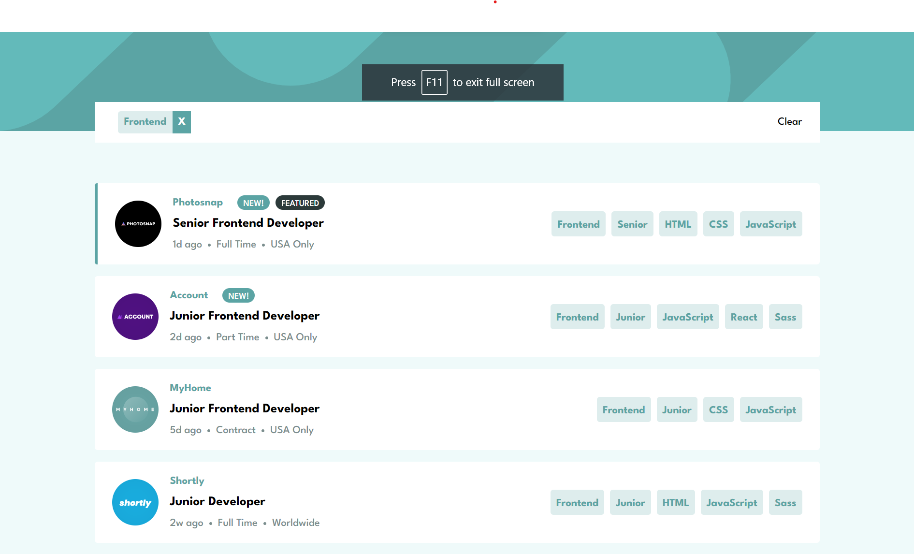

# Frontend Mentor - Results summary component solution

This is a solution to the [Results summary component challenge on Frontend Mentor](https://www.frontendmentor.io/challenges/results-summary-component-CE_K6s0maV). Frontend Mentor challenges help you improve your coding skills by building realistic projects.

## Table of contents

-   [Overview](#overview)
    -   [The challenge](#the-challenge)
    -   [Screenshot](#screenshot)
    -   [Links](#links)
-   [My process](#my-process)
    -   [Built with](#built-with)
    -   [What I learned](#what-i-learned)
    -   [Continued development](#continued-development)
    -   [Useful resources](#useful-resources)

## Overview

The challenge is building out a results summary component and getting it as close to the design as possible. For this challenge I attempted to use Tailwindcss for the first time.

### The challenge

Users should be able to:

-   View the optimal layout for the interface depending on their device's screen size
-   See hover and focus states for all interactive elements on the page

### Screenshot

### Links

-   Solution URL: https://www.frontendmentor.io/challenges/job-listings-with-filtering-ivstIPCt/hub
-   Live Site URL: https://dlee1993.github.io/FEM-job-listings/

## My process

So for this challenge I decided to break it down into various components, header, jobList, job, pill and tag. This  allowed me to concentrate on small challenges that lead to the completion of the full challenge. So the header is obviously the header and then we had the main component the jobList, this consisted of the filter bar and the individual jobs, then we have the job which consisted of the job details and the filter tags and pill ( the pills are shown on the job that is new, featured or both). The tags are used as the user click events and to show the categories of each job. I used the click events of the tags to show the filter bar and filter the list to only include that jobs that had categories including the tags the user clicked. I used props to pass information between components, although for large projects it would not be performant, it was the perfect job for this project.

### Built with

-   Semantic HTML5 markup
-   Tailwindcss
-   Flexbox
-   Mobile-first workflow
-   [React](https://reactjs.org/) - JS library

### What I learned

For this challenge my main focus point of learning was tailwindcss, this challenge gave me the opportunity to start understanding how to use utility classes with responsive design in mind.

### Continued development

I am going to continue to use tailwind to grow and develop my understanding. I also aim to better my understanding of react best practices

### Useful resources

-   Tailwindcss Docs (https://www.tailwindcss.com) - This helped me understand how to implement gradients and boxshadows with utility classes

## Author

-   Frontend Mentor - https://www.frontendmentor.io/profile/DLee1993
